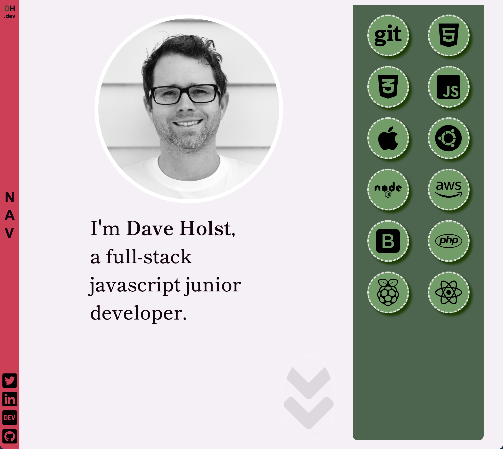
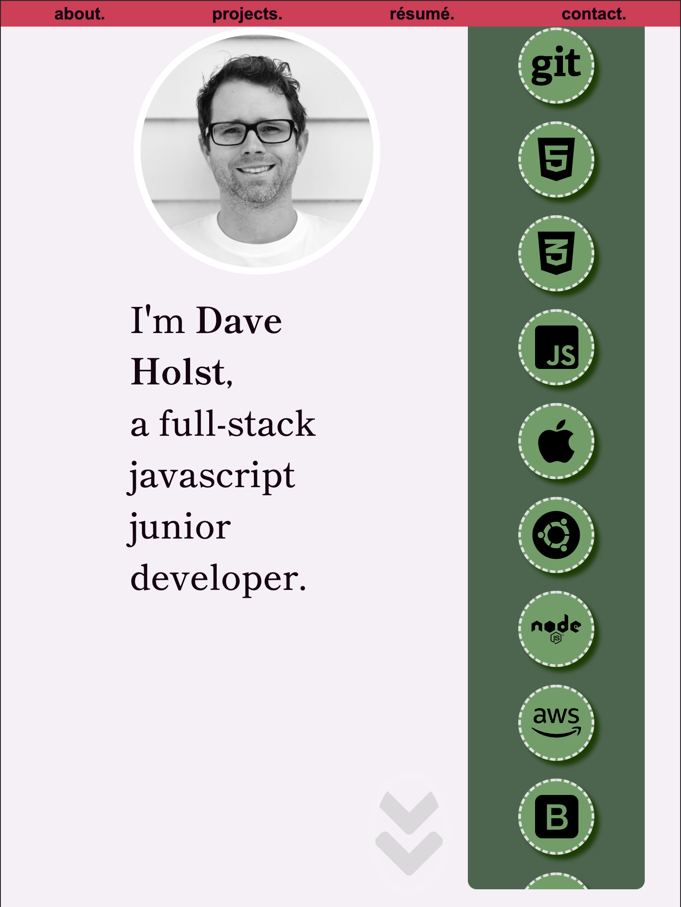
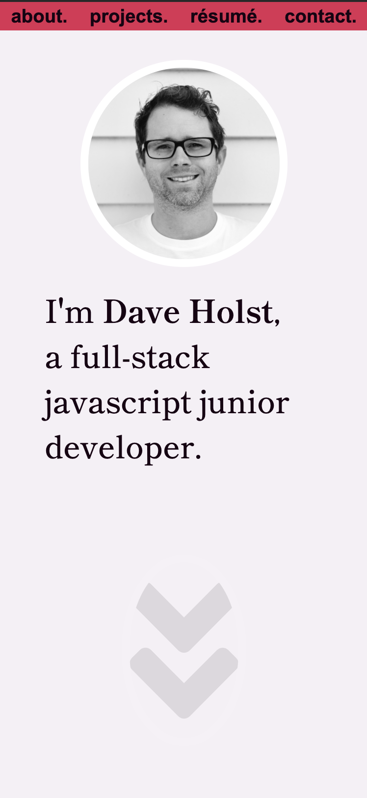

# Personal Portfolio

Design and build a portfolio webpage to display your work. Page to contain lots of placeholder for future additions and development.

## Page Link

Website can be found on GitHub Pages Here: https://daveholst.github.io/portfolio/

## Screenshot

### Desktop Resolution

### iPad Resolution

### iPhone Resolution

## Task

Welcome to this week's homework! This is an even-numbered week, so you won't be given any starter code. Instead, you'll create a web application from scratch! This week, you'll build a portfolio page, which you can add to as the course progresses.

A portfolio of work can showcase your skills and talents to employers looking to fill a part-time or full-time position. An effective portfolio highlights your strongest work as well as the thought processes behind it. Students who have portfolios with deployed web applications (meaning they are live on the web) are typically very successful in their career search after the boot camp. This last point can’t be stressed enough: having several deployed projects is a minimum requirement to receive an initial interview at many companies.

With these points in mind, in this homework you’ll set yourself up for future success by applying the core skills you've recently learned: flexbox, media queries, and CSS variables. You'll get to practice your new skills while creating something that you will use during your job search. It’s a win-win that you'll likely be grateful for in the future!

**Note:** If you don't have enough web applications to showcase at this point, use placeholder images and names. You can change them to real applications as you create them later in the course.

Let’s take a look at what a user story written from the perspective of a hiring manager might look like. As you might remember from your first homework, we follow the AS AN / I WANT / SO THAT format.

## User Story

AS AN employer
I WANT to view a potential employee's deployed portfolio of work samples
SO THAT I can review samples of their work and assess whether they're a good candidate for an open position

## Acceptance Criteria

Here are the critical requirements necessary to develop a portfolio that satisfies a typical hiring manager’s needs:

GIVEN I need to sample a potential employee's previous work

WHEN I load their portfolio
- [x] THEN I am presented with the developer's name, a recent photo, and links to sections - about them, their work, and how to contact them
WHEN I click one of the links in the navigation
- [x] THEN the UI scrolls to the corresponding section
WHEN I click on the link to the section about their work
- [x] THEN the UI scrolls to a section with titled images of the developer's applications
WHEN I am presented with the developer's first application
- [x] THEN that application's image should be larger in size than the others
WHEN I click on the images of the applications
- [x] THEN I am taken to that deployed application
WHEN I resize the page or view the site on various screens and devices
- [x] THEN I am presented with a responsive layout that adapts to my viewport

## TODO / Future Improvements

- [x] check about me text
- [x] maybe update badges to match my skills? // or more placeholders?
- [ ] link resume? not complete so maybe not?
- [x] project screenshots / place holder -- maybe 2 real/ link to GH
- [x] add contact me section? submission box maybe?
- [x] re-arrange resume and projects
- [x] check updates on ipad
- [x] build README.md
  - [ ] add known issues
  - [x] add future features?
- [ ] replace contact section with correct details and form.
- [ ] implement form validation to prevent spam.
- [ ] does the mobile top nav bar need to be static?
- [ ] move over to daveholst.dev domain
